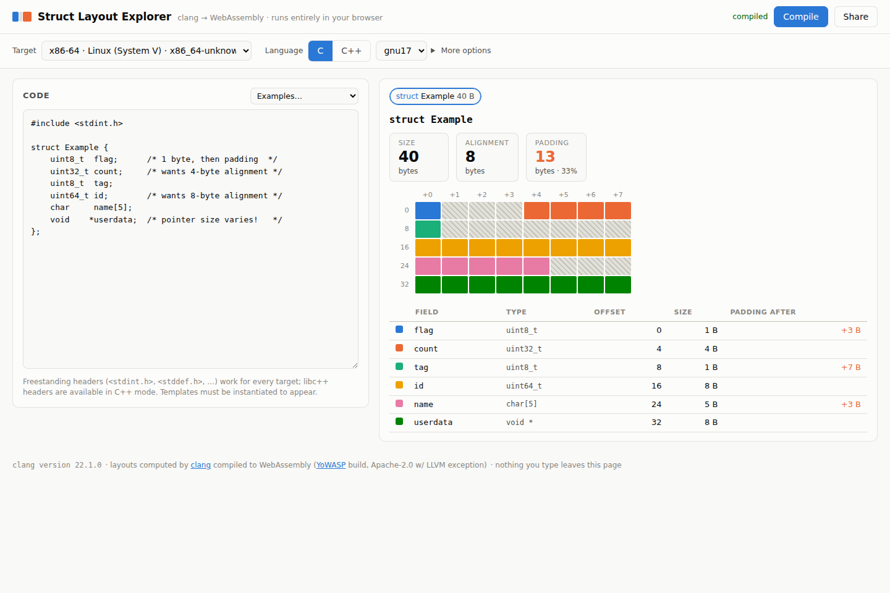

# Struct Layout Explorer

Visualize how C and C++ compilers lay out structs — field offsets, sizes,
alignment, and padding — for **any target LLVM supports**, computed by the
real thing: **clang compiled to WebAssembly**, running entirely in your
browser. No server, no build step; every file here is static.



## What it does

- Paste a struct/class/union declaration (C or C++), pick a target triple,
  and get the exact memory layout clang would use on that target:
  per-field offsets, sizes, the record's `sizeof`/alignment, C++ details
  (`dsize`, `nvsize`, vtable pointers, base subobjects), and every byte of
  padding, drawn as a byte-grid memory map with bit-level rendering for
  bit-fields.
- ~40 curated targets (x86-64 SysV & MSVC, AArch64 incl. Apple & Windows,
  Arm32, RISC-V, wasm32/64, PowerPC incl. AIX, MIPS, s390x, SPARC, LoongArch,
  AVR, MSP430, m68k, Hexagon, Xtensa, BPF, NVPTX, AMDGCN, …) plus a
  free-form custom-triple input. Since layout is computed by clang's own
  frontend, every ABI quirk (i386 vs MSVC `long double`, AVR's byte
  alignment, `arm64_32`'s ILP32 pointers, MSVC vs Itanium C++ object model,
  AIX preferred alignment…) is authentic.
- Options: C vs C++ (each with selectable standard version, C89→C23,
  C++03→C++26), `#pragma pack`-style max field alignment (`-fpack-struct`),
  MS bit-field layout (`-mms-bitfields`), `-fshort-enums`, `-fshort-wchar`,
  `-Wpadded` diagnostics, plus an escape hatch for arbitrary extra flags.
- Freestanding headers (`<stdint.h>`, `<stddef.h>`, `<limits.h>`, …) resolve
  for every target; libc++ headers are available in C++ mode; WASI libc
  headers can optionally be mapped in for other targets.
- Monaco editor (self-hosted, JetBrains Mono, custom “Glacier” light and
  “Nocturne” dark themes that follow your OS setting) with clang's
  diagnostics shown inline as squiggles.
- Share button encodes the source + all options into the URL fragment.
- Installable PWA: after the first visit the app shell, editor, fonts and
  the clang runtime are cached, so it keeps working fully offline (a
  “✓ available offline” badge appears in the footer once everything is
  cached).

## How it works

1. [`@yowasp/clang`](https://github.com/YoWASP/clang) provides clang 22
   compiled to WebAssembly/WASI. It runs in a Web Worker with a virtual
   filesystem — used as a library, not a CLI. The worker fetches the
   package's ~27 MB gzipped tarball straight from the npm registry (CORS
   allows it), unpacks it in memory, and caches it with the Cache API; run
   `tools/vendor-clang.sh` to vendor the assets into `vendor/clang/`
   instead, which the worker prefers, making the site fully
   self-contained with no third-party requests.
2. The app compiles your code with
   `-fsyntax-only -Xclang -fdump-record-layouts-complete` for the chosen
   `--target`. Layout is computed by clang's frontend, which supports every
   target's ABI regardless of which LLVM backends exist in the build.
3. A second tiny TU of probe structs measures the target's scalar sizes
   (`sizeof(long)`, pointer size, …); if a field's type still can't be
   sized (odd typedefs, enums with custom underlying types), one more pass
   compiles `struct probe { T v; };` per unknown type. That yields exact
   extents for every field so padding can be drawn byte-accurately.
4. `js/layout-parser.js` parses the dump (Itanium & Microsoft C++ ABIs,
   bit-fields, virtual bases, anonymous members); `js/render.js` draws the
   byte grid and field table.

## Deployment

Hosted on **Cloudflare Pages**. Every push to `main` runs
`.github/workflows/deploy-cloudflare.yml`, which uploads the repository as-is
(no build) with `wrangler pages deploy`. The workflow needs two repository
secrets: `CLOUDFLARE_API_TOKEN` (a token with *Cloudflare Pages: Edit*) and
`CLOUDFLARE_ACCOUNT_ID`. `_headers` sets long-lived caching for `vendor/`;
`.assetsignore` keeps VCS/CI files out of the upload.

## Running locally

Any static file server works:

```sh
python3 -m http.server 8000
# open http://localhost:8000
```

(Serving from `file://` won't work — the app uses ES modules and a worker.)

## Repository layout

```
index.html          app shell
css/style.css       theme (light/dark) + layout
js/app.js           orchestration, options, URL state
js/clang-worker.js  Web Worker owning the wasm clang instance
js/layout-parser.js -fdump-record-layouts text → structured records
js/size-resolver.js scalar probe table + type-spelling → size resolution
js/model.js         render model: leaf extents, padding runs, stats
js/render.js        summary tiles, byte grid, field table, tooltips
js/targets.js       curated targets, standards, examples
js/editor.js        Monaco setup: themes, diagnostics → markers
sw.js               service worker (offline app shell)
manifest.webmanifest, icons/  PWA metadata
tools/vendor-clang.sh  optional: vendor the wasm assets for offline hosting
tools/build-monaco.sh  rebuilds vendor/monaco + vendor/fonts (output is committed)
vendor/clang/       YoWASP runtime (bundle.js) — see NOTICE.md for licensing
vendor/monaco/      Monaco editor bundle (MIT)
vendor/fonts/       JetBrains Mono (OFL-1.1)
.github/workflows/  deploys main to Cloudflare Pages
_headers            Cloudflare Pages response headers (caching)
```

## Caveats

- Templates must be instantiated (e.g. `Pair<double> p;`) to appear — the
  dump only contains completed record layouts.
- Hosted libc headers (`<stdio.h>`, …) only exist natively for the
  `wasm32-wasip1` target; the "WASI libc headers" toggle maps them in for
  other targets with the caveat that libc-internal types then reflect
  wasi-libc rather than the target's real libc. Freestanding and libc++
  headers are fine everywhere.
- A few exotic field sizes fall back to estimates (marked with ≈) when a
  type can be neither measured nor matched to a dumped record.
